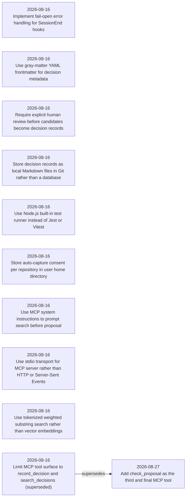

# Decision Graph

```mermaid
flowchart LR
    node_2026_08_27_three_tool_mcp_surface_with_proposal_checker["2026-08-27<br/>Add check_proposal as the third and final MCP tool"]
    node_2026_08_16_fail_open_session_hook_over_blocking_capture["2026-08-16<br/>Implement fail-open error handling for SessionEnd hooks"]
    node_2026_08_16_gray_matter_yaml_frontmatter_over_custom_parser["2026-08-16<br/>Use gray-matter YAML frontmatter for decision metadata"]
    node_2026_08_16_human_review_gate_for_candidates["2026-08-16<br/>Require explicit human review before candidates become decision records"]
    node_2026_08_16_markdown_on_git_over_sqlite_database["2026-08-16<br/>Store decision records as local Markdown files in Git rather than a database"]
    node_2026_08_16_node_native_test_runner_over_jest_vitest["2026-08-16<br/>Use Node.js built-in test runner instead of Jest or Vitest"]
    node_2026_08_16_per_repo_opt_in_consent_over_global_auto_capture["2026-08-16<br/>Store auto-capture consent per repository in user home directory"]
    node_2026_08_16_prompt_instructions_for_search_enforcement["2026-08-16<br/>Use MCP system instructions to prompt search before proposal"]
    node_2026_08_16_stdio_mcp_transport_over_http_sse_server["2026-08-16<br/>Use stdio transport for MCP server rather than HTTP or Server-Sent Events"]
    node_2026_08_16_tokenized_weighted_search_over_vector_embeddings["2026-08-16<br/>Use tokenized weighted substring search rather than vector embeddings"]
    node_2026_08_16_two_tool_mcp_surface_over_multi_tool_api["2026-08-16<br/>Limit MCP tool surface to record_decision and search_decisions (superseded)"]

    node_2026_08_16_two_tool_mcp_surface_over_multi_tool_api -->|supersedes| node_2026_08_27_three_tool_mcp_surface_with_proposal_checker
```
