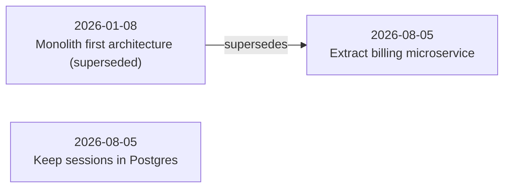

# IdeaGit - User Manual

**IdeaGit** is a local, Git-backed decision memory and contradiction detector for MCP-capable coding agents (such as Claude Code, Cursor, Codex, and others).

---

## 1. What IdeaGit Does & Where It Helps

### The Problem
Coding agents have strong recall of current code syntax, but zero memory of *why* choices were made in past sessions. Without IdeaGit, agents repeatedly propose options your team already considered and rejected:
- Proposing Redis when you intentionally chose Postgres to avoid extra infrastructure.
- Re-architecting session handlers that were governed by strict memory constraints.
- Rediscovering known architectural trade-offs through trial and error.

### Where IdeaGit Helps
- **Prevents Wasted Debates**: The agent searches prior decisions before proposing structural changes.
- **Context Preservation**: Preserves real rationale (`## Why`) and what would change your mind (`## What would change our mind`).
- **Local & Git-Native**: Stores decisions in `.decisions/*.md` files directly in your repository.
- **CI Governance**: `ideagit doctor` flags broken links, stale decisions, and active contradictions.

---

## 2. Installation & Quick Start

### Step 1: Build the Repository
```bash
npm install
npm run build
npm test
```

### Step 2: Configure Your MCP Agent Client
Add IdeaGit to your agent's MCP settings configuration file (e.g., `.claude/mcp.json`, `~/.cursor/mcp.json`, or your IDE's MCP config):

```json
{
  "mcpServers": {
    "ideagit": {
      "command": "node",
      "args": ["/absolute/path/to/ideagit/dist/server.js"]
    }
  }
}
```

---

## 3. How to Use & How Output Looks

### Workflow A: Explicit Recording (`record_decision`)

When you make a technical choice during a session, tell your agent to record it.

#### User Prompt Example:
> *"Record our decision to keep sessions in Postgres rather than adding Redis."*

#### Agent MCP Tool Call:
```json
{
  "name": "record_decision",
  "arguments": {
    "title": "Keep sessions in Postgres rather than adding Redis",
    "chose": "Session state stays in existing Postgres instance using an unlogged table.",
    "why": "Operational cost of running Redis outweighs latency wins at current traffic.",
    "rejected": [
      { "name": "Redis", "reason": "Adds a second datastore without dedicated on-call engineers." }
    ],
    "changes_mind": "Session traffic exceeding 50k concurrent requests.",
    "scope": ["src/session/**"],
    "provenance": {
      "session_id": "session_2026_08_05",
      "commit": "a1b2c3d"
    }
  }
}
```

#### What Gets Saved on Disk: `.decisions/2026-08-05-keep-sessions-in-postgres.md`
```markdown
---
id: 2026-08-05-keep-sessions-in-postgres
title: Keep sessions in Postgres rather than adding Redis
status: active
date: 2026-08-05
scope:
  - src/session/**
tags: []
supersedes: []
superseded_by: null
provenance:
  session_id: session_2026_08_05
  commit: a1b2c3d
---

## Chose

Session state stays in existing Postgres instance using an unlogged table.

## Rejected

- **Redis** — Adds a second datastore without dedicated on-call engineers.

## Why

Operational cost of running Redis outweighs latency wins at current traffic.

## What would change our mind

Session traffic exceeding 50k concurrent requests.
```

---

### Workflow B: Automated Contradiction Prevention (`search_decisions`)

Server instructions automatically direct your agent to search decision memory before proposing changes to architecture, storage, or dependencies.

#### Interaction Example:
> **Developer:** *"Let me know how to speed up sessions using Redis."*  
> **Agent:** *(Calls `search_decisions(query: "Redis session storage", scope: "src/session/handler.ts")`)*  
> **Agent Output:**
> 
> 🛑 **Prior Decision Conflict Detected**  
> 
> This repository previously decided against Redis for session storage:
> - **Decision**: `2026-08-05-keep-sessions-in-postgres`
> - **Date**: 2026-08-05  
> - **Scope**: `src/session/**`  
> - **Rejected Alternative**: Redis (adds a second datastore without on-call rotation).  
> - **Why**: Operational cost outweighs latency gains at current traffic.  
> - **Revisit Condition**: Traffic exceeding 50k concurrent requests.  
> 
> *Has your traffic or operational constraint changed?*

---

### Workflow C: Repository Health Check (`ideagit doctor`)

Run `ideagit doctor` in your terminal or CI pipeline to detect malformed records, broken references, stale decisions, and active contradictions.

#### Command:
```bash
node bin/ideagit.js doctor
```

#### Healthy Repository Output:
```text
Examined 3 decision(s).
✓ All decision records are healthy.
```

#### Output When Issues Exist (Exits with status code 1):
```text
Examined 4 decision(s).

Found 3 issue(s):

  ✖ [2026-08-05-new-auth] Contradiction detected: active decision '2026-08-05-new-auth' conflicts with '2026-08-01-old-auth' over overlapping scope [src/auth/**]. Neither supersedes the other.
  ✖ [2026-08-05-service-split] Dangling supersedes reference: '2025-12-01-monolith' does not exist
  ⚠ [2026-04-14-session-pg] Governed file 'src/session/store.ts' modified after decision date (2026-04-14); record may be stale
```

---

### Workflow D: Visual Decision Graph (`ideagit graph`)

Generate a visual architectural graph of all decision records and supersedes relationships.

#### Command:
```bash
node bin/ideagit.js graph
```

#### Terminal Output:
```text
Generated Mermaid decision graph at /path/to/repo/.decisions/GRAPH.md
```

#### Rendered `.decisions/GRAPH.md` Output:
```markdown
# Decision Graph


```

---

### Workflow E: Opt-In Auto-Capture & Candidate Review

Capture candidate decisions from transcript logs at session end without interrupting developer workflow.

#### Step 1: Grant Repository Consent
```bash
node bin/ideagit.js consent
```
```text
Auto-capture disclosure:
IdeaGit will parse session transcripts and queue candidate decisions for human review.
Enable auto-capture for this repository? [y/N] > y
Enabled. Candidates will be queued for `ideagit review` after each session.
```

#### Step 2: Review Pending Candidates
```bash
node bin/ideagit.js review
```
```text
────────────────────────────────────────────────────────────
# Retain REST API for mobile client instead of GraphQL

## Chose
REST endpoints

## Rejected
- **GraphQL** — Requires complex schema stitching and custom caching.

## Why
Avoids schema stitching and custom caching infrastructure.
────────────────────────────────────────────────────────────
[a]ccept / [s]kip / [e]dit / [q]uit review > a
Recorded 2026-08-05-retain-rest-api-for-mobile-client
```

---

## 4. Summary of CLI Commands

| Command | Purpose |
|---|---|
| `ideagit serve` (or `ideagit`) | Starts MCP server over stdio for coding agents |
| `ideagit init` | Prints a ready-to-paste MCP config with the absolute server path filled in |
| `ideagit doctor` | Runs diagnostics (frontmatter, dangling refs, staleness, contradictions) |
| `ideagit graph` | Generates Mermaid flowchart at `.decisions/GRAPH.md` |
| `ideagit consent` | Manages per-repository auto-capture consent (`status` / `revoke`) |
| `ideagit review` | Interactive CLI to accept, edit, or skip pending candidate decisions |
| `ideagit phase0 [dir]` | Scores real `claude -p` extraction against hand-labeled real sessions (ROADMAP.md Phase 0 gate) |

---

## 5. Reporting Issues During Beta

Before filing an issue, attach:

1. Output of `node bin/ideagit.js doctor`
2. `.decisions/.pending/errors.log`, if it exists — this is the only record
   of auto-capture or hook failures, and it never leaves your machine on its
   own, so it has to be attached manually
3. What you expected to happen vs. what happened

Without these, most reports are unreproducible — the team has no telemetry
and cannot see anything that happened on your machine unless you send it.
